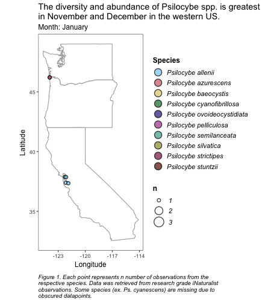

Animations
================
Michele Wiseman
June 7th, 2021

Good resources for maps and animation
* https://luisdva.github.io/rstats/GIS-with-R/
* https://m-clark.github.io/posts/2020-03-23-covid/
* https://cengel.github.io/R-spatial/mapping.html
* https://blog.mastermaps.com/
* http://thematicmapping.org/downloads/world_borders.php
* https://www.r-graph-gallery.com/choropleth-map-in-r.html
* https://github.com/adamgibbons/oregon-choropleth
* https://blogs.oregonstate.edu/developer/2017/06/26/building-geometries-new-data-locations-api/
* https://www.r-bloggers.com/2013/01/maps-in-r-plotting-data-points-on-a-map/


# Example 1: Animating data from iNaturalist

Techniques learned/used:
* How to use ```rinat``` package
* Tidying data
* Animating geom_point/geom_size data with gganimate
* Manual scaling
* Adding multiple scales
* Creating a wrapping function

``` r
#load required packages 
library(ggspatial) 
library(lwgeom)
library(sf)
library(tidyverse)
library(rgeos)
library(ggmap)
library(rinat)
library(gganimate)
library(rgdal)
library(maps)
library(geojsonio)

# Make a dataframe for the state maps
states <- map_data("state")

# Make a dataframe for the west coast (using one of the map packages above)
west_coast <- states %>%
  filter(region %in% c("california", "oregon", "washington"))

# Use rinat package to download a inat dataframe
psilocybe_inat <- get_inat_obs(
  taxon_id = 54026,
  place_id = 65360,
  quality = "research",
  geo = TRUE,
  maxresults = 10000,
  meta = FALSE
)

# Filter for accuracy and open coordinates
psilocybe_inat_accurate <- psilocybe_inat %>% 
  filter(public_positional_accuracy < 1000) %>% 
  filter(coordinates_obscured == "false")

# Loading colorblind safe palette into a vector
safe_colorblind_palette <- c("#88CCEE", "#CC6677", "#DDCC77", "#117733", "#332288", "#AA4499", 
                             "#44AA99", "#999933", "#882255", "#661100", "#6699CC", "#888888")


# Changing columns for year month and day so I can animate by month
psilocybe_inat_accurate_animation <- psilocybe_inat_accurate %>%
  separate(datetime, sep="-", into = c("year", "month", "day"))

# Writing a function so I can automatically wrap text (otherwise it will get cut off)

wrapper <- function(x, ...) 
{
  paste(strwrap(x, ...), collapse = "\n")
}

#Renaming months from numbers to characters
psilocybe_inat_accurate_animation$month[psilocybe_inat_accurate_animation$month=="01"] <- "January"
psilocybe_inat_accurate_animation$month[psilocybe_inat_accurate_animation$month=="02"] <- "February"
psilocybe_inat_accurate_animation$month[psilocybe_inat_accurate_animation$month=="03"] <- "March"
psilocybe_inat_accurate_animation$month[psilocybe_inat_accurate_animation$month=="04"] <- "April"
psilocybe_inat_accurate_animation$month[psilocybe_inat_accurate_animation$month=="05"] <- "May"
psilocybe_inat_accurate_animation$month[psilocybe_inat_accurate_animation$month=="06"] <- "June"
psilocybe_inat_accurate_animation$month[psilocybe_inat_accurate_animation$month=="07"] <- "July"
psilocybe_inat_accurate_animation$month[psilocybe_inat_accurate_animation$month=="08"] <- "August"
psilocybe_inat_accurate_animation$month[psilocybe_inat_accurate_animation$month=="09"] <- "September"
psilocybe_inat_accurate_animation$month[psilocybe_inat_accurate_animation$month=="10"] <- "October"
psilocybe_inat_accurate_animation$month[psilocybe_inat_accurate_animation$month=="11"] <- "November"
psilocybe_inat_accurate_animation$month[psilocybe_inat_accurate_animation$month=="12"] <- "December"

# Re-ordering months so they go from January -> December
psilocybe_inat_accurate_animation$month <- factor(psilocybe_inat_accurate_animation$month, levels = month.name)

# Creating vectors for my labels, this tidies things and allows me to use my wrapper function. 
title <- "The diversity and abundance of Psilocybe spp. is greatest in November and December in the western US."
caption <- "Figure 1. Each point represents n number of observations from the respective species. Data was retrieved from research grade iNaturalist observations. Some species (ex. Ps. cyanescens) are missing due to obscured datapoints."

# Here's the final animation and plot code
my.animation<-ggplot(data = west_coast) + 
  geom_polygon(aes(x = long,
                   y = lat,
                   group = group),
               fill = "white",
               color = "darkgray") + 
  coord_quickmap()+
  geom_count(data = psilocybe_inat_accurate_animation, 
             mapping = aes(
               x = longitude,
               y = latitude,
               fill = scientific_name), 
             color = "black",
             shape= 21,
             alpha= 0.7,
             stroke = 1) +
  scale_size_area(
    breaks= c(1,2,3,4),
    max_size = 4) +
  scale_size(
    range = c(2,7), 
    breaks = c(1,2,3,4)) +
  scale_fill_manual(
    name = "Species",
    values = safe_colorblind_palette) +
  theme_bw() +
  guides(fill = 
           guide_legend(
             override.aes = list(size=5))) +
  theme(
    plot.background= element_blank(),
    panel.background = element_rect(fill = "white"),
    panel.grid.major = element_blank(),
    panel.grid.minor = element_blank(),
    plot.caption = element_text(face= "italic", hjust = 0),
    legend.text = element_text(face= "italic", size = 11),
    legend.title = element_text(face= "bold", size = 12),
    title = ggtext::element_markdown(hjust = 0.5, size=12),
    axis.title.x = element_text(margin=margin(5,0,5,0)),
    axis.title.y = element_text(margin=margin(0,5,0,0))) +
      labs(title= (wrapper(title, width = 60)),
       subtitle = 'Month: {closest_state}',
       x = 'Longitude',
       y = 'Latitude',
       caption = wrapper(caption, width =75)) +
  transition_states(
    month,
    transition_length = 2,
    state_length = 3
  ) +
  enter_fade() + 
  exit_shrink() +
  ease_aes('sine-in-out')


# I need a two part animation process to ensure the plot will size correctly.
animate(my.animation, height = 500, width = 450)
anim_save("final_animation.gif", animation = last_animation())
```

Here is my final product:



  
