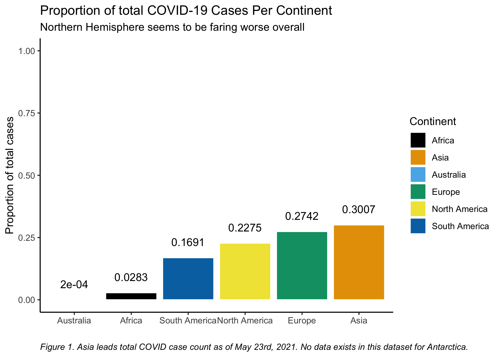
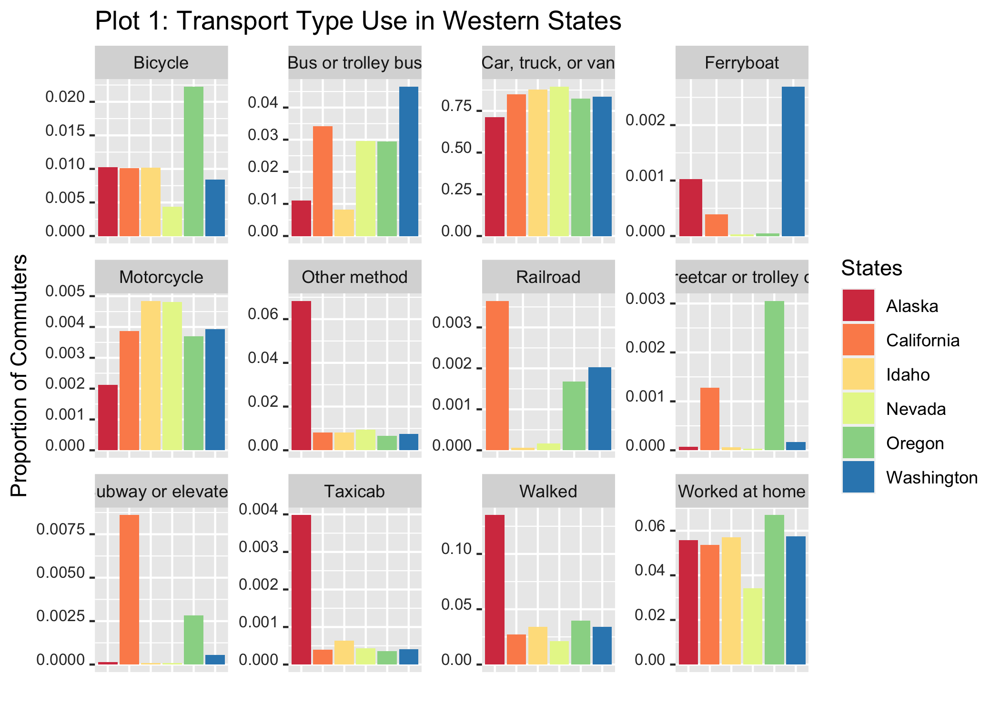

R Bar chart examples for Gent Lab
================
Michele Wiseman
June 4th, 2021

## Bar charts

### Example 1: COVID

The first example uses:

-   dplyr filtering and grouping
-   labeling of title, axes, caption, and bars
-   reordering of bars
-   colorblind friendly palette
-   labeling of bars
-   manual scaling of the y-axis
-   element\_text theme adjustment

``` r
#load necessary packages
library(tidyverse)
library(stringr)
library(hrbrthemes)
library(scales)

#load data
covid<- read_csv("https://raw.githubusercontent.com/owid/covid-19-data/master/public/data/owid-covid-data.csv", na = ".")  

view(covid)

#this makes a new dataframe (total_cases) that only has the latest COVID cases count and location data
total_cases <- covid %>% filter(date == "2021-06-01") %>% 
  group_by(location, total_cases) %>% 
  summarize()

#get number for world total cases. This is probably way too wordy. 
world <- total_cases %>%
  filter(location == "World") %>%
  select(total_cases)

#make new column that has the proportion of total world cases (number was total on that day)
total_cases$prop_total <- total_cases$total_cases/world$total_cases

#this specifies what the continents are so we can filter them out with dplyr
continents <- c("North America", "South America", "Antarctica", "Asia", "Europe", "Africa", "Australia")

#Using dyplr, we're choosing total_cases pnly for the continents
contin_cases <- total_cases %>%
  filter(location %in% continents)

#Loading a colorblind accessible pallete
cbbPalette <- c("#000000", "#E69F00", "#56B4E9", "#009E73", "#F0E442", "#0072B2", "#D55E00", "#CC79A7")

#Ploting it on a bar chart. 
plot1 <- ggplot(contin_cases, 
           aes(x = reorder(location, prop_total),
               y = prop_total,
               fill = location)) +
  geom_bar(stat="identity", color="white") +
  ylim(0, 1) +
  geom_text(aes(y = prop_total,
                label = round(prop_total, 4)),
            vjust = -1.5) +
  scale_fill_manual(name = "Continent", 
                    values = cbbPalette) +
  labs(title = "Proportion of total COVID-19 Cases Per Continent", 
       subtitle = "Northern Hemisphere seems to be faring worse overall", 
       caption ="Figure 1. Asia leads total COVID case count as of May 23rd, 2021. No data exists in this dataset for Antarctica.") +
  ylab("Proportion of total cases") +
  xlab("")+ #this makes x-axis blank
  theme_classic()+
    theme(
    plot.caption = element_text(hjust = 0, face = "italic"))

ggsave("plot1.png")
```



### Example 2: Transportation

This second example uses:

-   dplyr for filtering
-   facet wrapping with free scales
-   change in scale palette
-   labels: change legend label, remove x-axis label, add title
-   some theme customization

``` r
# load necessary packages
library(tidyverse)
library(stringr)
library(lubridate)
library(RColorBrewer)

# download the data to dataframe "commute"
commute <- read_rds(url("http://data.cwick.co.nz/commute.rds"))

# make a subset of the western states
states <- c("or", "ak", "ca", "wa", "id", "nv")
commute_nw <- filter(commute, state %in% states)

# plot with ggplot
plot2 <- ggplot(commute_nw)+
  geom_col(mapping = aes(x=state_name, y=prop, fill= state_name)) +
  facet_wrap(~factor(transport_type), scales = "free") +
  labs(title = "Transport Type Use in Western States") +
  scale_fill_brewer("States", palette = "Spectral") +
  xlab("") +
  ylab("Proportion of Commuters") +
  theme(axis.text.x = element_blank(),
        axis.ticks.x = element_blank(),
        axis.text.y = element_text(color = "grey20", size = 8, angle = 0, hjust = 1, vjust = 0, face = "plain"))

ggsave("plot2.png")
```



### Example 3: more soon
